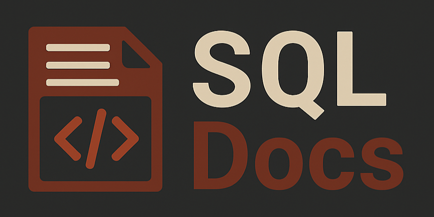

___________________________________________________________________________________________________________________________________________


 SQL Docs is a framework designed to standardize SQL query documentation. Its goal is to provide a clear and consistent structure that facilitates
readability, maintenance, and the automatic generation of documentation in HTML.

___________________________________________________________________________________________________________________________________________


## 🎯 Objective

The framework is divided into 7 sections:
- Sections 1 to 5 must be completed before writing the SQL query.
- Sections 6 and 7 accompany the writing of the query, describing its
different parts.

___________________________________________________________________________________________________________________________________________

## 📑 Framework Structure

1.  Summary → Summary of the purpose of the query.
2.  Related Programs → Related queries.
3.  Sources → Data sources used.
4.  Products → Result of the query (table, view, insert, etc.).
5.  Historical Versions → Change log.
6.  Steps → Step-by-step comments and explanations of the process.
7.  Notes (NT) → Additional observations about the query.

___________________________________________________________________________________________________________________________________________

## ⚠️ Important Notes

-   It is mandatory to follow the framework’s wording to allow for the subsequent automatic generation of HTML.
-   Sections can be omitted depending on project needs (this does not affect HTML export).
-   Each section must begin and end with the correct syntax.

___________________________________________________________________________________________________________________________________________

## 📑 Details of each framework section:

–Summary: Brief summary of the purpose of the query.
– Created Date: xx/xx/xxxx
– Description: Technical/functional details about the operation of the query.
– References: E.g., ticket or issue number.

–Related Programs: List of other processes related to the query (e.g., other queries, PY files, processes, dashboards, etc.).
– Program: For example a query name.

–Sources: This section details each of the consumed data sources.
– source_1
– source_2
– source_3

–Product 1: Here you describe each of the products generated by the query, such as a table, view, insert, etc.
– Description: Brief description of the product.
– Name: Table/view name.
– Type: Table/View/Insert/Update/Delete.
– Process: Create or Replace / Truncate / etc.

–Historical Versions: A record of changes made to the query.
– Date -(User)- Description of the change.
– 01/01/2025-(john.doe)- Initial creation.
– 15/01/2025-(jane.smith)- Filter adjustment.

–Step 1: Short comment of the logic applied in the query. Used to divide it into stages, explaining the goal of each part of the process.

–NT: Special comments that apply to specific lines of the query, relevant for understanding the process.

___________________________________________________________________________________________________________________________________________

## 📑 Framework to copy:

```
–Summary:
–Created Date: xx/xx/xxxx
–Description:
–References:
-–<
-------------------------------------------------------------------------
–Related Programs:
–Query:
-–<
-------------------------------------------------------------------------

–Sources:
– source_1
– source_2
-–<
-------------------------------------------------------------------------

–Product 1:
–Description:
–Name:
–Type:
–Process:
-–<
-------------------------------------------------------------------------

–Historical Versions:
–Date -(User)- Description of the change.
–xx/xx/xxxx-(xxxxxxx)- xxxxxxxxxxxxx
-–<
-------------------------------------------------------------------------

------------------------------------------------------------------------

–Step 1: –-

–NT: –-
```
___________________________________________________________________________________________________________________________________________
___________________________________________________________________________________________________________________________________________